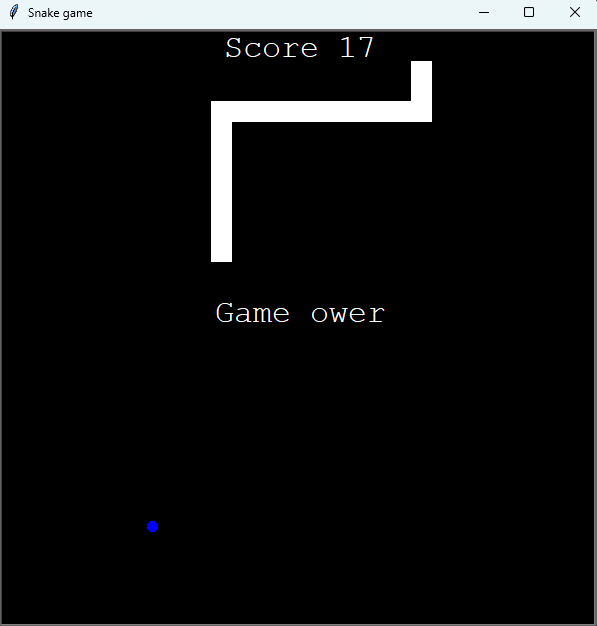

# Snake-Game
A simple snake game, created as part of Udemy's 100 day Python course

## Features
- Move across the screen
- Eat generated "food"
- Grow when eating
- Game over when touching the border or the tail 
- Tracks the score

## Controls
how to play:
```
Arrow Keys - move the snake 
```
The snake can't go into itelf, so you can't make a 180-degree turn instantly

## Screenshot 
Include a screenshot of the game window:
<p align="center">
  
</p>

## Requirements
```
- Python 3.x
- turtle (standard in Python)
```

## Installation 
Clone the repository:
```
git clone https://github.com/Lukajekul/Snake-Game.git
cd Snake-Game
```

## Usage
Run the game in your terminal:
```
python Snake-Game.py
```
The game will start immediately.

## Credits
Built during the "100 Days of Code: The Complete Python Pro Bootcamp" on Udemy by Dr. Angela Yu.

## License

This project is licensed under the MIT License.  
See the [LICENSE](LICENSE) file for details.
